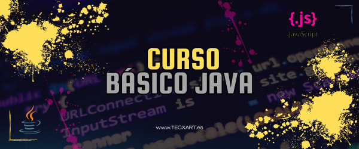

# <center> CURSO DE JAVA Básico. </center>


## Aquí podremos aprender java con ejercicios y soluciones.


#EJERCICIOS y sus soluciones

###EL FAMOSO FIZZBUZZ<br>
```
/*
 * Escribe un programa que muestre por consola (con un print) los
 * números de 1 a 100 (ambos incluidos y con un salto de línea entre
 * cada impresión), sustituyendo los siguientes:
 * - Múltiplos de 3 por la palabra "fizz".
 * - Múltiplos de 5 por la palabra "buzz".
 * - Múltiplos de 3 y de 5 a la vez por la palabra "fizzbuzz".
 */
```

### SUCESCIÓN DE FIBONACCI
```
/*
 * Escribe un programa que imprima los 50 primeros números de la sucesión
 * de Fibonacci empezando en 0.
 * - La serie Fibonacci se compone por una sucesión de números en
 *   la que el siguiente siempre es la suma de los dos anteriores.
 *   0, 1, 1, 2, 3, 5, 8, 13...
 */
```

  Las Soluciones la tenéis en la carpeta soluciones[SOLUCIONES](https://github.com/tecxion/Curso-Java/tree/main/Soluciones).
